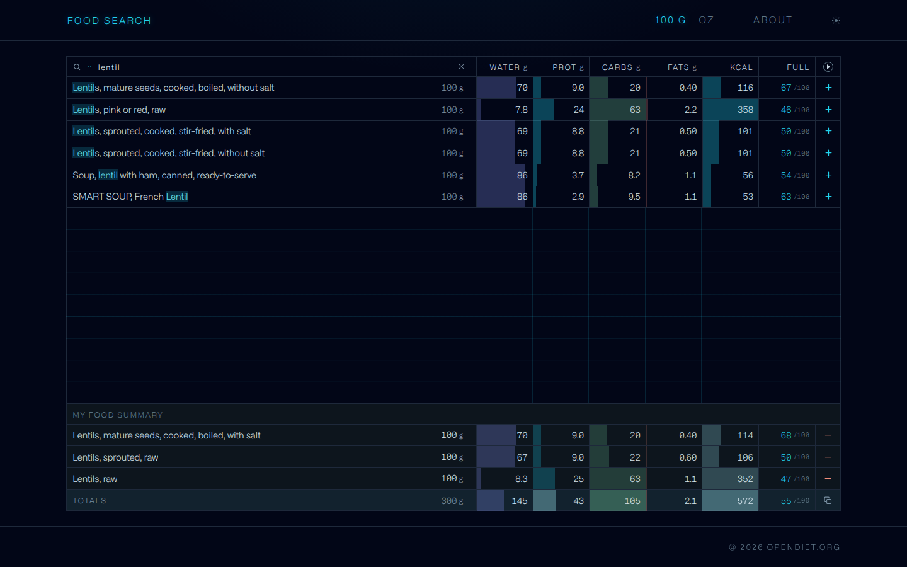
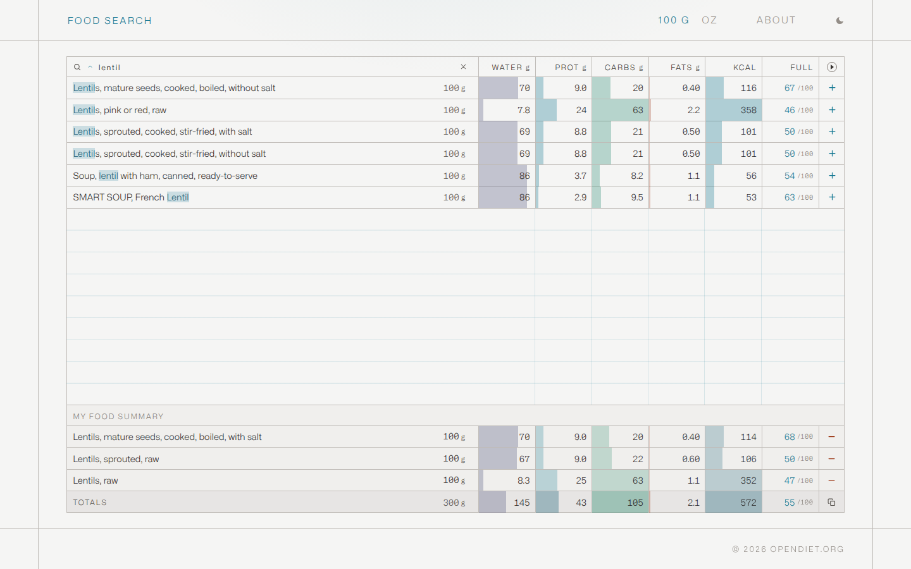
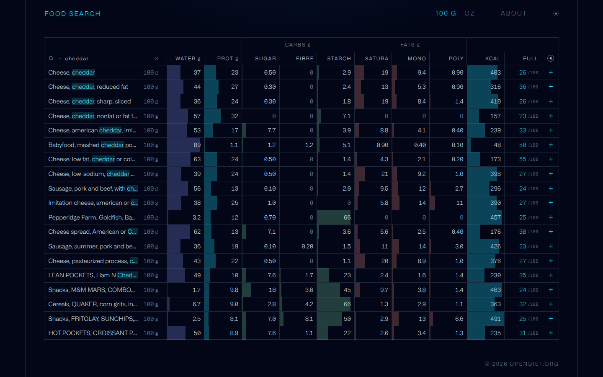
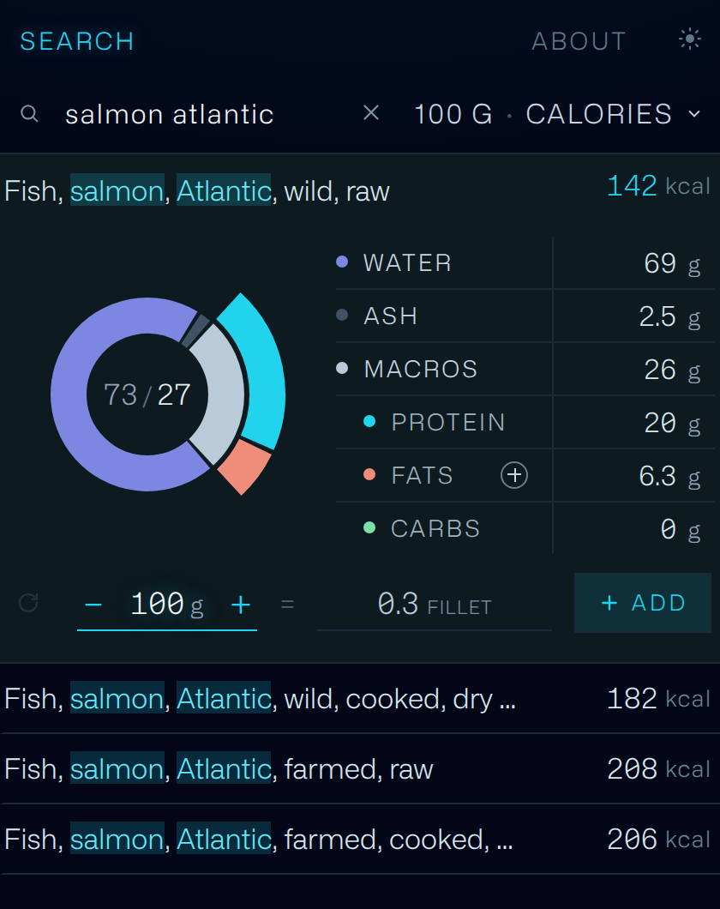

# OpenDiet

**[opendiet.org](https://opendiet.org/)** — protein, carbs, fat and calories for 16,000+ foods, in one searchable list.

No account, no tracking, no food diary. Type a food, read the numbers, compare it against
anything else. That is the whole product.



## Why

The data is public. USDA FoodData Central publishes it, it is public domain, and anyone can
download it. But actually *reading* it is another matter — the official site is built for
querying one food at a time, most nutrition sites bury the numbers under adverts and
sign-up walls, and the reference site people used to point to — NutritionData — was bought
and is long gone.

So there was no fast way to answer a question as ordinary as "how much protein is in lentils
versus chickpeas, per calorie?" without opening several tabs and doing arithmetic.

This is that missing page. One table, every number visible at once, sortable by any column.

## What it does

- **Search and sort** any column — water, protein, carbs, fat, calories, or name.
- **Expand the table** and each macro breaks into its parts: sugar, fibre and starch under
  carbohydrate; saturated, monounsaturated and polyunsaturated under fat. Every column
  explains itself on hover.
- **Two measures.** Read everything per 100 g/ml or per ounce; the whole table follows,
  figures and portions alike.
- **Two themes.** A switch in the nav, remembered between visits, applied before the first
  paint so a light page never flashes dark on the way in.
- **Open a food** and it is drawn rather than listed — a donut of what the food actually is
  (most food is mostly water), with its macros on a ring of their own, and a table beside it.
  Press a macro and it slides in and breaks into its parts.
- **Build a plate.** Added foods drop into a summary with running totals, their portions
  typed in directly, and a copy button that puts the plate on the clipboard as a shopping
  list. Saved in your browser, not on a server.
- **A fullness score** per food — a per-calorie index built from macro energy shares, fibre
  density and the sheer bulk a calorie buys. The plate carries the weighted average of its own.
- **Thermic effect toggle.** Deducts the energy digestion itself costs: 25% of protein calories,
  8% of carbohydrate, 2% of fat.

There is deliberately no daily target to measure a plate against: turning a calorie figure
into a protein or carbohydrate goal is contested enough that the table would be taking a
side it has no business taking. It states what is on the plate.

A tablet runs the phone's design, because below 1000px of width the table can no longer
name a food — but it runs it at a tablet's size rather than a phone's. Everything steps
up one notch together: type, rows, controls, the drawings, and the column they sit in.
The column is held off the glass by real gutters instead of running to the bezel, and
there is no frame around it, because a bordered column on a big screen reads as a phone
app someone parked there.

There is a light theme, on the same palette walked the other way:



Expanded, each macro breaks into its parts and the grid says which belong to which:



Opened, a food is drawn rather than listed:



## The data

From USDA FoodData Central, committed to this repo as static JSON:

| Library | Foods | Source release |
|---|---|---|
| SR LEGACY | 7,756 | SR Legacy, 2019-04-02 |
| SURVEY FNDDS | 8,661 | Survey (FNDDS), 2020-03-31 |

SR Legacy is what the site reads. The everyday-food problem is solved in the search
ranking rather than by filtering the data, so no curated subset is needed and a long
result list costs nothing.

Values are per 100 g, or per 100 ml for foods measured by volume — FoodData Central's own basis.
A blank cell means USDA reports no value for that nutrient, not that the value is zero.

USDA FoodData Central is a work of the US federal government and is in the public domain.
See [`data/README.md`](data/README.md) for the exact nutrient ids, the category mapping, and how
to regenerate the files.

Numbers are averages for a generic item. Brand, cut, ripeness and cooking method all move them.

## Running it

There is no build step, no dependency install and no package manager. The repo root *is* the
site. Serve it with anything:

```sh
python3 -m http.server 8000
# then open http://localhost:8000
```

Opening `index.html` from the filesystem will not work — the food libraries are fetched over
HTTP, and `file://` blocks that.

The one runtime dependency is React, which `support.js` loads from unpkg at boot. Everything
else — the data, the design system, the fonts — is served from this repo.

## Layout

```
index.html          the whole app: markup, styles and logic
support.js          the small framework index.html is written against
ds/                 design system — tokens, stylesheet, fonts
data/               the three food libraries as JSON, plus their provenance
tools/              one-off generators (data build, preview image); not part of the site
DESIGN.md           why it is built this way — the long version of this README
```

The repo also carries work that opendiet.org does not serve. It is not described here.

One copy of the site, at the root, deployed by GitHub Pages from `main`. There is no
staging copy and no promotion step — `beta/index.html` is a redirect to the root and
nothing else, so an old bookmark cannot land on a stale build.

## Licence

[PolyForm Noncommercial 1.0.0](PolyForm%20NonCommercial%201.0.0.txt).

Free to use, copy, modify and share for any **noncommercial** purpose — personal use, research,
teaching, charitable work. Commercial use needs a separate licence; open an issue if you want one.

This is source-available rather than open source in the OSI sense, since that definition does not
permit a restriction on commercial use.

The USDA data itself carries no such restriction — it is public domain and you can do anything
you like with it.

Some marks inlined as SVG paths are from
[Material Design Icons](https://pictogrammers.com/library/mdi/), used under the Apache
License 2.0.

Some meshes in this repo are derived from the
[MakeHuman](http://www.makehumancommunity.org/) project's base mesh and morph targets,
released by the MakeHuman Team as **CC0** — thank you. The bake is
`tools/makehuman_bake.py`; the upstream data is not committed here, the script says
where to fetch it.
